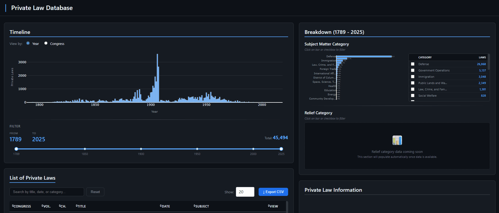
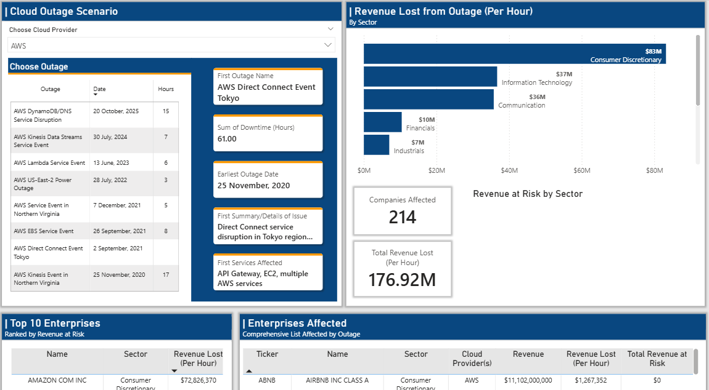

# Hi, I'm Kenneth 👋

I'm a data analyst building projects that tackle real-world problems using data extraction, analysis, and visualization. These projects develop my analytical toolkit: pulling data from APIs, building Python ETL pipelines, writing SQL queries, and creating dashboards that turn raw data into actionable insights.

---

## Projects
> Click title for more details
### 📜 [Congressional Private Laws Database *(In Progress)*](https://github.com/kennethnguyenhtx-hub/Enterprise-Cloud-Outage-Analysis/blob/main/README.md)

<table>
<tr>
<td width="60%">

</td>
<td width="40%" valign="top">

**Collaboration with UH Law School and UH IT Department**
---
Building the first comprehensive database of U.S. Congressional private laws spanning 1789-2025. Working with Professor Chris Mirasola to digitize, categorize, and make searchable over 45,000 private laws that have never been systematically compiled.

**Key Highlights:**
- Processed 45,000+ private laws from government sources
- Developing an AI classification pipeline using OpenAI API
- Built interactive web application for searching and filtering

**Technical Skills:**

`Python` · `Dash` · `Plotly` · `MySQL` · `API Integration`

</td>
</tr>
</table>

### ☁️ [Enterprise Cloud Outage Analysis](https://github.com/kennethnguyenhtx-hub/Enterprise-Cloud-Outage-Analysis/blob/main/README.md)

<table>
<tr>
<td width="60%">

</td>
<td width="40%" valign="top">

**Analyzing financial impact of cloud outages on U.S. enterprises**
---
Parsed 12,000+ SEC 10-K filings to map cloud provider dependencies across 2,500+ Russell 3000 companies and calculate revenue exposure during major outages.

**Key Findings:**
- AWS dominates at 70% market share among disclosing companies
- Cloud dependency grew from 62% (2020) to 77.6% (2025)
- Single AWS outage put $2.5B+ in revenue at risk

**Tech Stack:**

`Python` · `SEC EDGAR API` · `yfinance` · `MySQL` · `Power BI` · `ETL Pipeline`

</td>
</tr>
</table>

---

## Contact

📧 [Kennethnguyen.htx@gmail.com](mailto:Kennethnguyen.htx@gmail.com)  
🔗 [LinkedIn](https://www.linkedin.com/in/kennethnguyenhtx)
